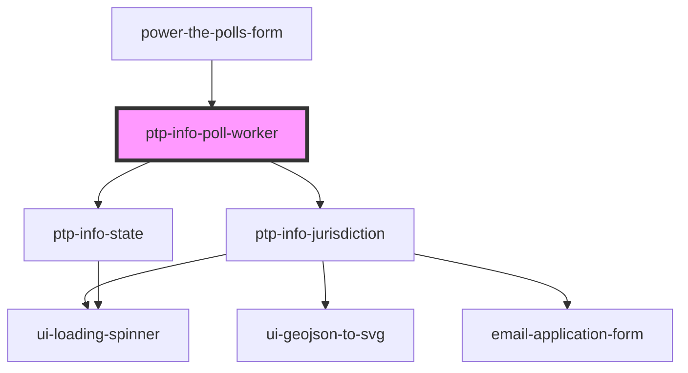

# work-elections

<!-- Auto Generated Below -->

## Overview

Display state or specific jurisdiction information for poll workers based on whether
the provided `state`, `county`, and `city` match a jurisdiction or not.

## Properties

| Property                | Attribute                  | Description                                                                                       | Type                                                                                                                                                                                                                                                                                                                                                                                                                                             | Default     |
| ----------------------- | -------------------------- | ------------------------------------------------------------------------------------------------- | ------------------------------------------------------------------------------------------------------------------------------------------------------------------------------------------------------------------------------------------------------------------------------------------------------------------------------------------------------------------------------------------------------------------------------------------------ | ----------- |
| `city`                  | `city`                     | City for matching to location                                                                     | `string \| undefined`                                                                                                                                                                                                                                                                                                                                                                                                                            | `undefined` |
| `cityTownVillageSuffix` | `city-town-village-suffix` |                                                                                                   | `string \| undefined`                                                                                                                                                                                                                                                                                                                                                                                                                            | `undefined` |
| `county`                | `county`                   | County for matching to location                                                                   | `string \| undefined`                                                                                                                                                                                                                                                                                                                                                                                                                            | `undefined` |
| `formData`              | --                         | Complete form data, if available, for `ptp-info-jurisdiction`                                     | `undefined \| { name?: string \| undefined; city?: string \| undefined; cityTownVillage?: string \| undefined; cityTownVillageSuffix?: string \| undefined; county?: string \| undefined; zip?: string \| undefined; address1?: string \| undefined; state?: string \| undefined; email?: string \| undefined; phone?: string \| undefined; languages?: string \| undefined; age?: string \| undefined; jurisdictionId?: string \| undefined; }` | `undefined` |
| `jurisdictionIdOrSlug`  | `jurisdiction-id-or-slug`  | ID or Slug of jurisdiction for Work Elections. Use in place of `state`, `county`, and `city`      | `number \| string \| undefined`                                                                                                                                                                                                                                                                                                                                                                                                                  | `undefined` |
| `showNextSteps`         | `show-next-steps`          | If `true`, this component will lso render 1-3 bullet items indicating the next steps for the user | `boolean`                                                                                                                                                                                                                                                                                                                                                                                                                                        | `undefined` |
| `state`                 | `state`                    | State for matching to location                                                                    | `string \| undefined`                                                                                                                                                                                                                                                                                                                                                                                                                            | `undefined` |

## Dependencies

### Used by

 - [power-the-polls-form](../power-the-polls-form)

### Depends on

- [ptp-info-jurisdiction](../ptp-info-jurisdiction)
- [ptp-info-state](../ptp-info-state)

### Graph

----------------------------------------------

