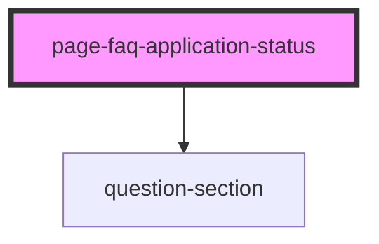

# page-faq-application-status

<!-- Auto Generated Below -->

## Properties

| Property | Attribute | Description                                                               | Type                                                                                                   | Default     |
| -------- | --------- | ------------------------------------------------------------------------- | ------------------------------------------------------------------------------------------------------ | ----------- |
| `data`   | --        | A list of entries to display in the FAQ see: FaqData.ts see: app-root.tsx | `undefined \| ({ sectionTitle: string; questions: { question: string; answer: () => string; }[]; }[])` | `undefined` |

## Dependencies

### Depends on

- [question-section](../page-faq)

### Graph

----------------------------------------------

